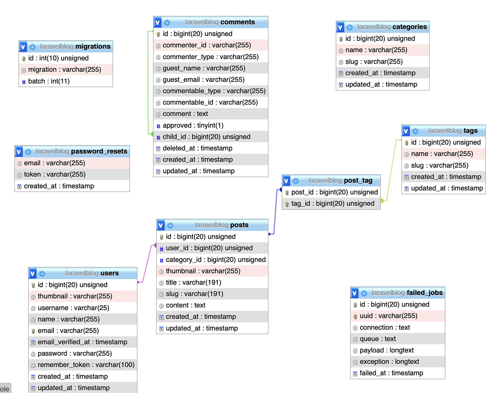

# AP8PO
## About project

The website will serve a non-profit organization to represent their organization. Users will be able to create their own articles about the operation of the organization.
The technologies used for developing is for FE **VueJS**, with which I already have experience from work and leisure, and **Laravel** for BE, when I also have a small experience.

 * Two type of users: Admin and Classic
 * Articles will be sorted by category and title.
 * Admin will have CRUD rights on user / articles / categories & password reset.
 * The Classic will have the CRUD rights to his own articles / categories.
 

## Technologies
 * VueJS 3
 * Laravel 9
 * MySQL

## DB design

created by [dbdiagram.io](https://dbdiagram.io/home).

## Time plan

###### 7.02. - 13.02.
    None
###### 14.02. - 20.02.
    Brainstorming
###### 21.02. - 27.02.
    Design + DB
###### 28.02. - 06.03.
    DB
###### 07.03. - 13.03.
    BE
###### 14.03. - 20.03.
    BE
###### 21.03. - 27.03.
    BE
###### 28.03. - 03.04.
    BE
###### 04.04. - 10.04.
    FE
###### 11.04. - 17.04.
    FE
###### 18.04. - 24.04.
    FE
###### 25.04. - 01.05.
    FE
###### 02.05. - 09.05.
    Testing + Optimalization
###### 10.05. - 15.05.
    Presentation

## Review (26. 04. 2022)
**Me:**
It is a long journey. I think, the best way how to describe it is by the image.

**Mikhail Larkin:**
The code is in alfa version, but is not shity code, it is a pretty clear.

## Final Review (10. 05. 2022)
This project was about a small website with options line registrations, login and CRUD posts.
First, I've created a database and backend. I used MySQL and Laravel 9.
After that, I started working with VueJS and Bootstrap and created a frontend.

One of my biggest problem was time management and understanding the Vue language.
The language is still new for me, and it was challenging in the beginning.

Now I finally have some fundamental skills with using Vue and Laravel together.
Also, I hope, I am now more able to work with time management and prioritising the tasks.

###### Troubleshooting
* type: npm run serve but nothing is on screen?
* type: npm run hot 
  * if it shows an error like "Error: listen EADDRINUSE: address already in use ::1:8080"
  * type: killall node
* and again: npm run hot